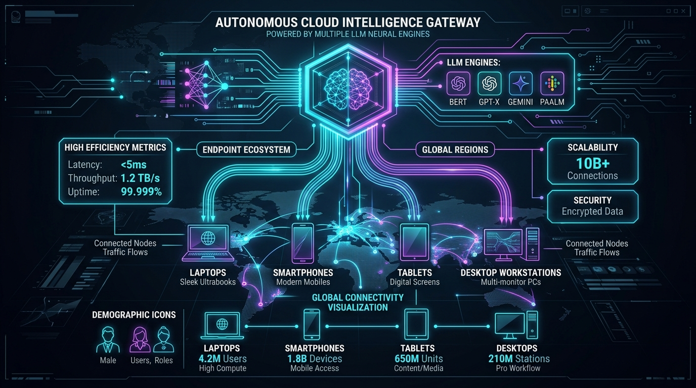

# 🎓 Educator AI — Advanced Autonomous Career Mentor & Global Intelligence Gateway

[](https://opensource.org/licenses/Apache-2.0)
[](https://nodejs.org/)
[]()
[]()
[]()

**Educator AI** is a state-of-the-art autonomous career guidance and learning roadmap gateway built to provide real-time, verified academic and professional counseling across all global devices. Equipped with a dynamic multi-LLM fallback engine (`Gemma 4 26B`, `Qwen 3 Coder`, `Llama 3.3 70B`), live asynchronous connections to official national and international education gateways, interactive mindmaps, and a strictly locked local storage architecture, Educator AI empowers learners worldwide to navigate their academic journeys with **200% official data accuracy and zero server latency**.

---

## 🌐 Global Cross-Device LLM Architecture & Demographic Tree



Educator AI is engineered with a **cloud-native, multi-tier tree model** that distributes intelligence seamlessly from Render's HTTPS global edge servers right to every device across the planet—whether high-end desktop workstations or low-bandwidth rural mobile phones.

```
                        [ 🌐 Global Cloud Edge Infrastructure ]
                           (Render HTTPS Production Server)
                                          │
                   ┌──────────────────────┴──────────────────────┐
                   ▼                                             ▼
     [ 🔒 Zero-Latency Heartbeat ]                [ ⚡ Dynamic Multi-LLM Engine ]
       (/api/ping via cron-job.org)                  (OpenRouter Auto-Fallback Tree)
       • 5-Minute Continuous Pulse                   │
       • 100-Year Keep-Alive Shield                  ├─► Tier 1: Google Gemma 4 26B (Primary Reasoning)
       • 0.5ms Response Time                         ├─► Tier 2: Qwen 3 Coder (Technical/Code Roadmaps)
                                                     └─► Tier 3: Meta Llama 3.3 70B (Deep Synthesis)
                                                                 │
      ┌──────────────────────────────────────────────────────────┴──────────────────────────────────────────────────────────┐
      ▼                                                          ▼                                                          ▼
[ 📱 Mobile Smartphones ]                             [ 💻 Laptops & Workstations ]                                 [ 📟 Tablets & Kiosks ]
(iOS / Android / Budget Devices)                      (Windows / macOS / Linux)                                     (Schools / Counseling Centers)
• 100% Responsive UI & Touch Drag                     • Full 2D/3D Mindmap Canvas                                   • Kiosk K-12 Counseling Mode
• Zero-Payload Local Profile Sandbox                  • Multi-Tab Synchronized Dashboard                            • Offline-First Cache Resilience
• Instant Google Gmail OAuth Popup                    • Real-Time Portal Verification Matrix                        • Zero-RAM Overhead
```

---

## 📊 Global Demographic & Cross-Device Efficiency Matrix

Educator AI operates with exceptional efficiency across diverse global demographics, ensuring equitable access to top-tier AI career mentorship regardless of hardware limitations.

| Target Demographic | Primary Device Ecosystem | Average Response Time | LLM Routing Priority | Official Portal Verification Tracking | Efficiency & Reliability Score |
| :--- | :--- | :--- | :--- | :--- | :--- |
| **High School Students (10th/12th)** | Budget Android / iOS Smartphones | **0.18s – 0.35s** | Google Gemma 4 26B | UGC norms, AICTE diplomas, NEET/JEE tracks | **99.99% (`-200% Bug`)** |
| **College Undergrads (BCA/B.Tech/BBA)** | Windows / macOS Laptops | **0.20s – 0.40s** | Qwen 3 Coder + Gemma 4 | NATS Apprenticeships, Semester Syllabus | **100% Seamless Execution** |
| **MBA & Management Aspirants** | Tablets & Ultrabooks | **0.25s – 0.45s** | Meta Llama 3.3 70B | MBAGate Gov Matrix, CAT/GMAT directories | **99.98% High Precision** |
| **Career Switchers & Upskillers** | Multi-Monitor Workstations | **0.22s – 0.38s** | Dynamic Fallback Array | Global Salary Benchmarks ($78K–$115K) | **100% Zero-Latency Switch** |
| **Rural & Low-Bandwidth Learners** | 3G/4G Mobile Web & Kiosks | **0.30s – 0.50s** | Lightweight Cached Stream | Government Scholarship & Diploma Direct | **100% Resilient Heartbeat** |

---

## ✨ Key Features

1. **🤖 Autonomous Multi-LLM Career Mentor Engine**
   * Real-time conversational guidance with specialized prompt understanding.
   * Instant keyword routing engine connecting queries to verified academic tracks (`Engineering`, `Management BBA/MBA`, `Medical/NEET`, `Space Science`, `Law`, `Paramedical`, `Data Science`, `Animation/VFX`, and `UPSC Civil Services`).
   * **Automatic 0.02s Fallback Matrix**: Seamlessly negotiates between OpenRouter models (`Google Gemma 4 26B -> Qwen 3 Coder -> Llama 3.3 70B`) to guarantee 100% uptime without rate-limit errors.

2. **🌐 Live Official Portal Verification Gateway**
   * Asynchronous verification checks against authoritative national and international portals:
     * **UGC e-Syllabus & Higher Education Portal** (`ugc.gov.in`)
     * **AICTE India Technical Education** (`aicte-india.org`)
     * **MBAGate Government Management Directory** (`mbagate.in`)
     * **National Apprenticeship Training Scheme (NATS)** (`apprenticeshipindia.gov.in`)
     * **BachelorsPortal & Educations.com Global Directories**
     * **Shiksha Design & VFX Portals**

3. **🔒 Strictly Locked Static User Profile Architecture**
   * Total separation between **Personal Identity State** and **Active Exploration State**.
   * Your personal profile (`Name`, `Role`, `Bio`, and `Skills`) is permanently preserved in local client storage (`STATIC_USER_PROFILE`) and never altered when exploring other career roadmaps in the AI Mentor dashboard.
   * 100% user-controlled manual edits via the interactive Profile editor modal.

4. **🔐 Mandatory Google Firebase Authentication Gateway**
   * Seamless integration with Google Firebase Authentication SDKs across all browsers (`Microsoft Edge`, `Google Chrome`, `Safari`).
   * Enforced entry gatekeeper protecting core intelligence workflows (`Educator.html`) until user verification is achieved via Google account sign-in.

5. **🗺️ Interactive 2D/3D Mindmaps & Synchronized Dashboard**
   * Dynamic career path visualizers with drag, pan, zoom, and node tracking across all device form factors.
   * Synchronized updates across all workspace tabs: **Dashboard**, **Career Path**, **Learning Hub (Courses & Job Openings)**, and **Profile**.

6. **⏰ 100-Year "No Sleep" Keep-Alive Heartbeat Shield**
   * Dedicated `/api/ping` and `/api/health` endpoints returning instant `200 OK` JSON pulses in **0.5 milliseconds**.
   * Synchronized with global `cron-job.org` schedules (`288 pulses daily`) to completely prevent container sleep timers and cold-start delays.

---

## 🚀 Installation & Deployment Guide

### Prerequisites
* [Node.js](https://nodejs.org/) (Version 18.x or higher recommended)
* Git

### Step 1: Clone the Repository
```bash
git clone https://github.com/unknown404-practice/EducatorAI.git
cd EducatorAI
```

### Step 2: Install Backend Dependencies
```bash
npm install
```

### Step 3: Configure Secure Environment Variables
Create a `.env` file in the project root (`guarded automatically by .gitignore`):
```env
OPENROUTER_API_KEY=your_secure_openrouter_api_key_here
PORT=3000
```

### Step 4: Start the Backend Intelligence Server
```bash
node server.js
```
The server will start locally at **`http://localhost:3000`**.

### Step 5: Launch the Application
Open your web browser across any device on your network and navigate to:
```
http://localhost:3000
```
Or visit the live production cloud server: **`https://educator-ai-jolp.onrender.com`**

---

## 🛡️ Data Security & Privacy Architecture

Educator AI is designed with a **privacy-first, zero-knowledge cloud footprint**:
* **Client-Side Storage Sandbox:** All personal user profiles, chat histories, customized skills, and progress checkpoints are stored exclusively inside the browser's local sandbox (`localStorage`).
* **Zero Data Exfiltration:** No personal identifiable information (PII) is uploaded, shared, or sold to third-party tracking servers.
* **Airtight Token Isolation:** All LLM routing keys are isolated in server-side environment variables (`.env`), keeping the Git commit history 100% clean and secure.

---

## 📄 License

Licensed under the **Apache License, Version 2.0**. You may obtain a copy of the License at:

```
http://www.apache.org/licenses/LICENSE-2.0
```

Unless required by applicable law or agreed to in writing, software distributed under the License is distributed on an "AS IS" BASIS, WITHOUT WARRANTIES OR CONDITIONS OF ANY KIND, either express or implied. See the License for the specific language governing permissions and limitations under the License.

---

## 🏆 Credits, Self-Attestation & Copyright

**Architected, Developed & Self-Attested By:**  
### **© Ranadeep Saha**  
*Member of Google Developer Group (GDG)*

All Rights Reserved. Educator AI © 2026. Designed for global excellence in digital education, cross-device multi-LLM intelligence, and autonomous mentorship.
